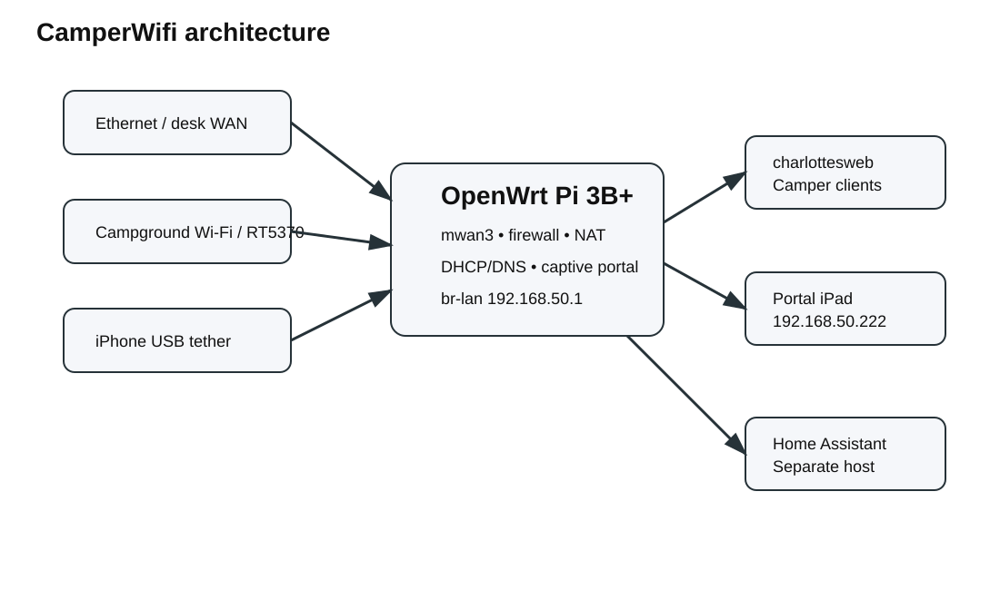
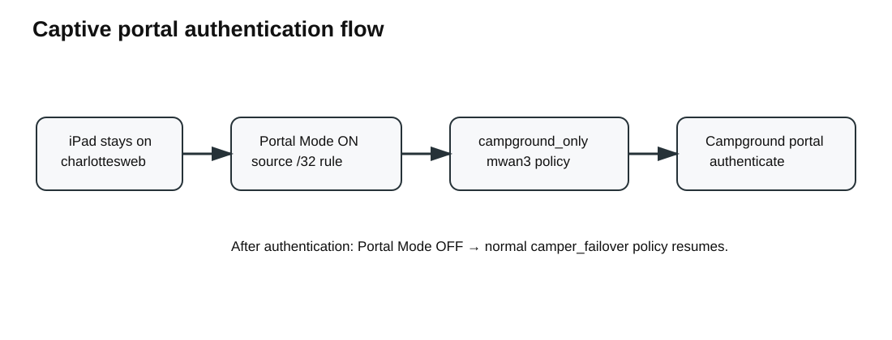

# CamperWifi

**CamperWifi** is an OpenWrt-based multi-WAN router project for RV/camper use. The reference build uses a Raspberry Pi 3B+ to keep one stable camper LAN while failing over among Ethernet, campground Wi-Fi, and iPhone USB tethering.

## v0.2.0 highlights

- Ethernet → campground Wi-Fi → iPhone mwan3 failover design
- Stable camper LAN (`192.168.50.0/24`) and `charlottesweb` reference SSID
- Dedicated iPad captive-portal routing workflow
- Installable **`luci-app-camperwifi`** source package for OpenWrt
- Restricted rpcd ACL for portal controls
- Backup/restore and diagnostics scripts
- GitHub Actions validation and tag-driven release ZIP generation
- Public issue/feature templates, diagrams, changelog, and build docs

## Reference topology

| Role | Reference configuration |
|---|---|
| Router | Raspberry Pi 3B+, OpenWrt 24.10.4 |
| Camper LAN | `192.168.50.0/24`, router `192.168.50.1` |
| Camper AP | `charlottesweb`, built-in 2.4 GHz radio |
| Primary WAN | `desk` / eth0, management IP `192.168.4.54` |
| Secondary WAN | `campground`, Ralink RT5370 USB Wi-Fi STA |
| Tertiary WAN | `IPhone_WAN` / eth1 USB tether |
| Portal client | reserved iPad `192.168.50.222` |

These are reference values from the working project, not universal defaults.

## Installable LuCI package

Package source is in [`openwrt/luci-app-camperwifi`](openwrt/luci-app-camperwifi). It packages the captive-portal controls as **Network → CamperWifi** and depends on `luci-base`, `mwan3`, and `rpcd-mod-file`.

See [`docs/BUILDING-IPK.md`](docs/BUILDING-IPK.md) for `.ipk` build instructions.

> **Safety:** the package does **not** overwrite network, firewall, wireless, DHCP, or mwan3 configuration. Those settings are installation-specific and changing them automatically could remove router access.

## Documentation

- [Installation](docs/INSTALL.md)
- [Configuration](docs/CONFIGURATION.md)
- [Captive portal](docs/CAPTIVE-PORTAL.md)
- [Build the OpenWrt package](docs/BUILDING-IPK.md)
- [Backup and restore](docs/BACKUP-RESTORE.md)
- [Troubleshooting](docs/TROUBLESHOOTING.md)
- [Home Assistant architecture](docs/HOME-ASSISTANT.md)
- [Security notes](docs/SECURITY.md)
- [Changelog](CHANGELOG.md)

## Captive portal concept

The designated iPad remains connected to the camper LAN. Portal Mode inserts a source-specific mwan3 rule that sends only the iPad through `campground_only`. After campground authentication, Portal Mode is disabled and the normal multi-WAN policy resumes.

## Development validation

GitHub Actions validates shell syntax, JSON, JavaScript syntax, and the package payload. A `v*` tag creates a downloadable source ZIP and SHA-256 checksum in GitHub Releases.

## Project status

v0.2.0 is a public development release. The captive-portal package assumes the underlying WAN/mwan3 design already exists. Future releases should make the portal client IP and mwan3 policy names UCI-configurable and may add first-class status telemetry for Home Assistant.

## License

MIT. See [LICENSE](LICENSE).
